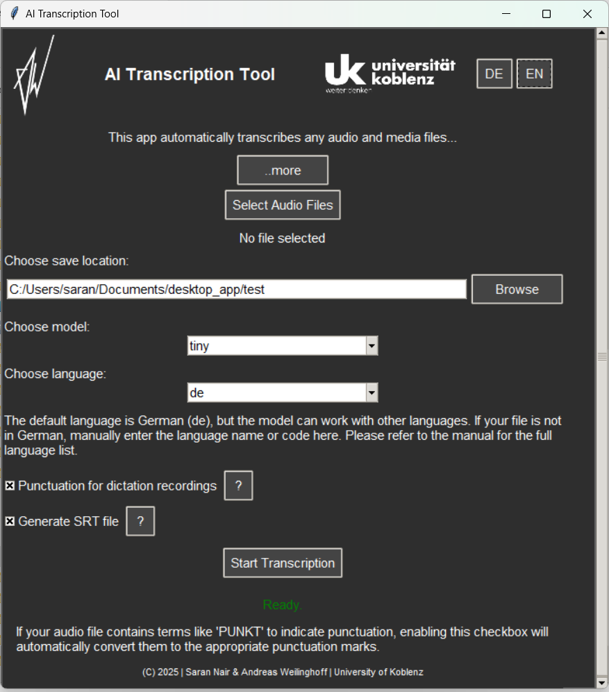
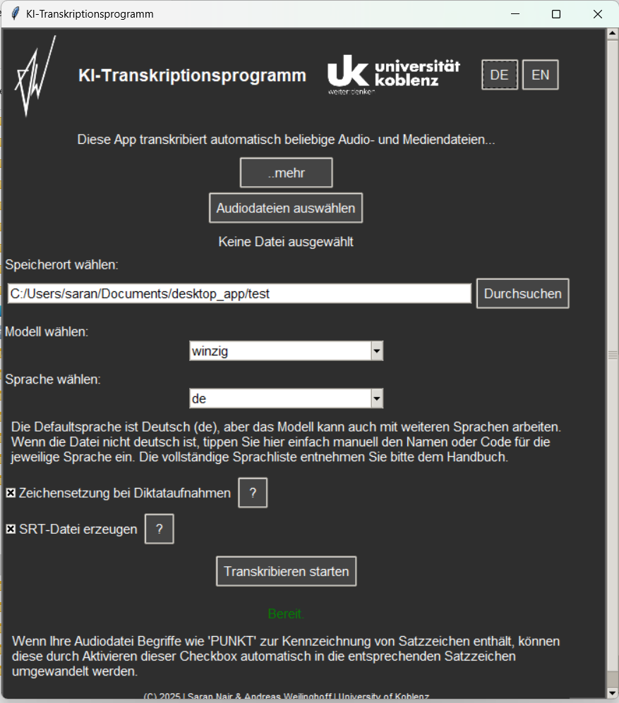

# AI Transcription Desktop App

A desktop transcription application for automatically converting audio and media files into written text using AI-based models.
The app runs **locally on your device** and does not transfer data externally.

---

## 📥 Download
The latest Windows executable: [Download main_app.exe](https://github.com/Andreas-Weilinghoff/whisper_desktop_app/releases/download/v1.1.0/main_app.exe)

The latest Linux (Debian) executable: [Download transcriber_1.0_amd64.deb](https://drive.google.com/file/d/1n9JbqiXPrNrjd5grHntJNDTpKhiHRUdg/view?usp=drive_link)

The latest MacOS executable: [Download AITranscriptionTool.dmg](https://drive.google.com/file/d/16691lwkThvxivVk8Qnu4JYij2f5phNAB/view?usp=drive_link)

*Note: This version is a pre-release and intended for internal use only.*

---

## 📂 Features

* Supports audio and video files: `.wav`, `.mp3`, `.m4a`, `.mp4`, `.mov`, `.ogg`
* Choose from multiple transcription models (tiny, medium, large, etc.)
* Supports multiple languages with manual language selection
* Optional punctuation formatting for dictation-style recordings
* Optional generation of `.srt` (subtitle) files
* Scrollable, user-friendly interface with expandable information sections
* Embedded links to the websites of Andreas Weilinghoff and the University of Koblenz

---

## 🚀 How to Run

### Windows

1. Download and double-click the `main_app.exe` file inside 'dist' folder (If you are choosing to build the app).
2. Ensure `ffmpeg` is installed and added to your system `PATH`.
3. Select an audio file, configure options and start transcription.

### Linux (Debian)
1. Decompress first using : xz -d transcriber_1.0_amd64.deb.xz
2. Install using : sudo dpkg -i transcriber_1.0_amd64.deb

### MacOS
1. Double click the .dmg file to 'mount' the disk
2. Double click the app icon in the newly shown window and follow on screen instructions.

---

## 📚 How to Cite

Weilinghoff, A. and Nair, S. (2025). AI Transcription Desktop App. https://github.com/Andreas-Weilinghoff/whisper_desktop_app

---

## 🖼️ Screenshots

<h3>🇬🇧 English Interface &nbsp;&nbsp;&nbsp;&nbsp; 🇩🇪 German Interface</h3>

  
  

